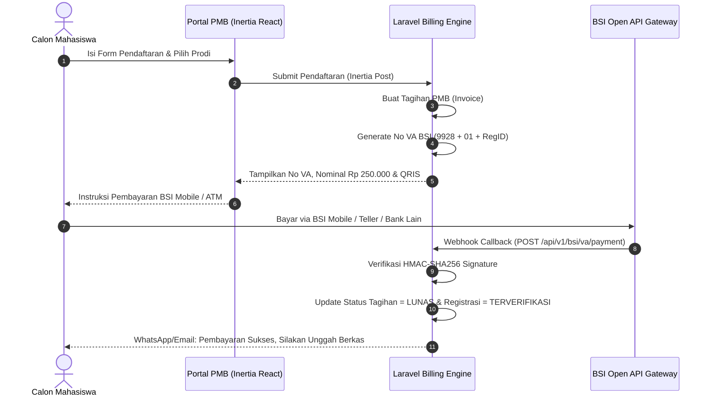

# 🏛️ BLUEPRINT MASTER ARSITEKTUR ENTERPRISE SIAKAD
## SISTEM INFORMASI AKADEMIK & TATA KELOLA KAMPUS TERPADU
### SEKOLAH TINGGI AGAMA ISLAM (STAI) AL-ITTIHAD CIANJUR
*Stack Arsitektur: Laravel + Inertia.js + React + PostgreSQL 16 + Tailwind CSS*
*Versi Dokumen: 2.0 (Laravel & Inertia Production Architecture 2026)*

---

## 📑 DAFTAR ISI
1. [Ringkasan Eksekutif & Identitas Proyek](#1-ringkasan-eksekutif--identitas-proyek)
2. [Arsitektur Sistem & Rekomendasi Tech Stack](#2-arsitektur-sistem--rekomendasi-tech-stack)
3. [Arsitektur Database & Skema Relasional (PostgreSQL Migrations)](#3-arsitektur-database--skema-relasional-postgresql-migrations)
4. [Sistem Autentikasi: 4-Digit Captcha & Session Security](#4-sistem-autentikasi-4-digit-captcha--session-security)
5. [Superadmin Master Control & Mesin Impersonasi (Menyamar Role)](#5-superadmin-master-control--mesin-impersonasi-menyamar-role)
6. [Modul Master Infrastruktur: Gedung & Ruang Kelas](#6-modul-master-infrastruktur-gedung--ruang-kelas)
7. [Modul Master Akademik & Tugas Struktural](#7-modul-master-akademik--tugas-struktural)
8. [Modul PMB & Otomasi VA Billing BSI](#8-modul-pmb--otomasi-va-billing-bsi)
9. [Modul Keuangan & Integrasi VA Bank Syariah Indonesia (BSI)](#9-modul-keuangan--integrasi-va-bank-syariah-indonesia-bsi)
10. [Modul KRS Online, Dosen PA & Financial Lock Guard](#10-modul-krs-online-dosen-pa--financial-lock-guard)
11. [Modul EDOM (Evaluasi Dosen Oleh Mahasiswa)](#11-modul-edom-evaluasi-dosen-oleh-mahasiswa)
12. [Modul KHS, Transkrip & Yudisium](#12-modul-khs-transkrip--yudisium)
13. [Engine Sinkronisasi Dua Arah: SIAKAD (Laravel) ⇄ SALAM LMS (React/Express)](#13-engine-sinkronisasi-dua-arah-siakad-laravel--salam-lms-reactexpress)
14. [Deployment VPS Hosting & Keamanan Produksi](#14-deployment-vps-hosting--keamanan-produksi)

---

## 1. Ringkasan Eksekutif & Identitas Proyek

Sistem Informasi Akademik (**SIAKAD**) STAI Al-Ittihad Cianjur dirancang sebagai *Core Operational Engine* dan *Single Source of Truth* bagi seluruh data akademik, keuangan, dan tata kelola perguruan tinggi. Sistem ini mengintegrasikan alur bisnis mulai dari Penerimaan Mahasiswa Baru (PMB), transaksi keuangan *Virtual Account* (VA) Bank Syariah Indonesia (BSI) secara *real-time*, registrasi Kartu Rencana Studi (KRS), evaluasi dosen (EDOM), hingga sinkronisasi data dua arah dengan platform pembelajaran **SALAM LMS**.

### Prinsip Utama Sistem:
* **Zero Data Redundancy**: Data induk (mahasiswa, dosen, mata kuliah, kelas) tersentralisasi dan di-broadcast secara otomatis.
* **Financial Integrity**: Seluruh hak akses akademik (KRS, KHS, Ujian) terlindungi oleh sistem pengunci keuangan otomatis (*Financial Lock Guard*) berbasis VA BSI.
* **Ultra-Lightweight & Robust**: Berjalan di atas framework **Laravel + Inertia.js + React** dengan konsumsi RAM server yang sangat minim (~60–90 MB), sangat tangguh menghadapi lonjakan akses (*traffic spike*) saat masa pengisian KRS.

---

## 2. Arsitektur Sistem & Rekomendasi Tech Stack

### Diagram Ekosistem SIAKAD & LMS:
```
+-----------------------------------------------------------------------------------+
|                            INTERNET / BROWSER CLIENT                              |
+-----------------------------------------------------------------------------------+
                                          | HTTPS / WSS
                                          v
+-----------------------------------------------------------------------------------+
|                        REVERSE PROXY: NGINX / SSL TERMINATION                     |
+-----------------------------------------------------------------------------------+
        |                                                 |
        v :8000 (SIAKAD - PHP-FPM)                        v :8080 (SALAM LMS)
+------------------------------------+          +------------------------------------+
|          SIAKAD APPLICATION        |          |             SALAM LMS              |
|  - Backend: Laravel (PHP 8.3/8.4)  |          |  - React 18 + Vite SPA             |
|  - Frontend Bridge: Inertia.js     |          |  - Node.js Express REST API        |
|  - UI Client: React + Tailwind CSS |          |  - MinIO S3 Document Storage       |
|  - Database Engine: Eloquent ORM   |          |  - Dynamic QR Attendance & CBT     |
|  - Background Queue: Redis Jobs    |          +------------------------------------+
+------------------------------------+                                 |
        |                  |                                           |
        |                  +========= SYNC GATEWAY (HTTP Client) ======+
        |                     (REST Webhook & HMAC Signature)
        v
+-----------------------------------------------------------------------------------+
|                              DATABASE & STORAGE LAYER                             |
|  - PostgreSQL 16 (Relational DB: SIAKAD Core & SALAM LMS Database)               |
|  - Redis 7 (Session Storage, Captcha Cache, Queue Worker, & Rate Limiting)        |
|  - MinIO / S3 Storage (Dokumen PMB, Ijazah, Slip, Foto Mahasiswa)                 |
+-----------------------------------------------------------------------------------+
                                          ^
                                          | Host-to-Host HTTPS
+-----------------------------------------------------------------------------------+
|                  BANK SYARIAH INDONESIA (BSI) OPEN API GATEWAY                    |
|  - BSI VA Billing Inquiry & Payment Callback Webhook                              |
+-----------------------------------------------------------------------------------+
```

### Rincian Tech Stack Resmi:
* **Backend Framework:** `Laravel (PHP 8.3/8.4)` — Framework PHP enterprise terlengkap dengan Eloquent ORM, Database Migrations/Seeders, Form Requests, Queue Workers, dan Scheduled Task Runner bawaan.
* **Frontend Bridge:** `Inertia.js v2` — Menghubungkan Laravel dan React secara mulus tanpa perlu menulis API endpoint boilerplate manual. Data dari Controller langsung diteruskan ke komponen React sebagai *props*.
* **Frontend UI Library:** `React + Tailwind CSS + Lucide Icons + Headless UI / Radix UI` — Antarmuka modern, interaktif, responsif, dan konsisten dengan SALAM LMS.
* **Database Engine:** `PostgreSQL 16` — Database relasional tangguh dengan dukungan JSONB, transaksi ACID, dan integritas foreign key.
* **Background Queue & Cache:** `Redis 7` (atau database queue fallback) — Memproses antrean webhook pembayaran BSI, pengiriman notifikasi WhatsApp, dan rekonsiliasi kas.
* **PDF & Spreadsheet Reporting:** `barryvdh/laravel-dompdf` / `snappy` dan `maatwebsite/excel` untuk cetak KRS, KHS, Transkrip resmi ber-kop institusi, dan rekonsiliasi keuangan.

---

## 3. Arsitektur Database & Skema Relasional (PostgreSQL Migrations)

### Matriks Entitas Database:

```
[buildings] 1----* [rooms]
[faculties] 1----* [study_programs] 1----* [curricula] 1----* [courses]
[academic_years] 1----* [academic_periods]
[users] 1----* [pmb_applicants] 1----* [student_invoices] 1----* [va_bsi_transactions]
[users] 1----* [lecturer_positions] *----1 [structural_positions]
[course_classes] 1----* [class_schedules] *----1 [rooms]
[course_classes] 1----* [krs_items] *----1 [krs_submissions] *----1 [users (Mahasiswa)]
[krs_items] 1----1 [course_grades]
[krs_items] 1----* [edom_responses] *----1 [edom_questions]
```

### Detail Tabel Inti (Laravel Migrations):

#### A. Infrastruktur & Gedung:
* `buildings`: `id, code, name, total_floors, address, is_active, created_at, updated_at`
* `rooms`: `id, building_id (FK), code, name, floor_number, capacity, room_type (TEORI, LABORATORIUM, AUDITORIUM, SEMINAR), facilities (JSONB: AC, Proyektor, Sound), is_active`

#### B. Master Akademik & Jabatan Struktural:
* `academic_years`: `id, code (e.g. 2026/2027), name, is_active`
* `academic_periods`: `id, academic_year_id (FK), semester_type (GANJIL, GENAP, PENDEK), start_date, end_date, krs_start_date, krs_end_date, revision_krs_end_date, grading_start_date, grading_end_date, is_active`
* `structural_positions`: `id, code, name (Ketua STAI, Waket I, Waket II, Waket III, Kaprodi, Sekretaris Prodi, Kepala BAAK, Kepala Bagian Keuangan), level, can_approve_krs, can_sign_transcripts`
* `lecturer_positions`: `id, user_id (FK), position_id (FK), study_program_id (FK nullable), decree_number (No SK), start_date, end_date, is_active`

#### C. PMB & Keuangan VA BSI:
* `pmb_periods`: `id, academic_year_id (FK), batch_number (Gelombang 1/2/3), start_date, end_date, registration_fee, is_active`
* `pmb_applicants`: `id, registration_number (PMB-2026-0001), user_id (FK), full_name, nik, phone_number, email, chosen_program_id_1, chosen_program_id_2, pathway (REGULER, BEASISWA, TAHFIDZ, PINDAHAN), status (DRAFT, MENUNGGU_PEMBAYARAN, TERVERIFIKASI, LULUS_SELEKSI, DITERIMA, DITOLAK), generated_nim, created_at`
* `fee_types`: `id, code (PMB, SPP_UKT, PRAKTIKUM, UJIAN_PROPOSAL, SIDANG_SKRIPSI, WISUDA), name, default_amount, is_periodic`
* `student_invoices`: `id, invoice_number (INV-202608-0001), user_id (FK), fee_type_id (FK), academic_period_id (FK), amount, discount_amount, penalty_amount, final_amount, due_date, status (BELUM_BAYAR, LUNAS, KADALUARSA, DIBATALKAN), paid_at`
* `va_bsi_transactions`: `id, invoice_id (FK), va_number (99280121010042), channel (BSI_MOBILE, ATM_BSI, TELLER, INTERBANK), amount, status (PENDING, PAID, EXPIRED), bsi_reference_no, payment_datetime, raw_callback_payload (JSONB)`

#### D. KRS, EDOM & Nilai:
* `krs_submissions`: `id, student_id (FK), academic_period_id (FK), total_credits, max_credits_allowed, status (DRAFT, DIAJUKAN, DISETUJUI_PA, DITOLAK), approved_by_pa_id (FK), approved_at, notes`
* `krs_items`: `id, krs_submission_id (FK), class_id (FK), status (TERDAFTAR, DISETUJUI, DIBATALKAN)`
* `edom_questionnaires`: `id, academic_period_id (FK), title, description, is_active`
* `edom_questions`: `id, questionnaire_id (FK), category (PEDAGOGIK, PROFESIONAL, KEPRIBADIAN, SOSIAL), question_text, scale_type (SKALA_1_5)`
* `edom_responses`: `id, krs_item_id (FK), question_id (FK), score (1-5), comment, is_anonymous (TRUE)`
* `course_grades`: `id, krs_item_id (FK), attendance_score (10%), assignment_score (20%), quiz_score (15%), mid_exam_score (25%), final_exam_score (30%), final_score, grade_letter (A, A-, B+, B, B-, C+, C, D, E), grade_point (4.0, 3.75, ...), is_locked, is_synced_to_lms`

---

## 4. Sistem Autentikasi: 4-Digit Captcha & Session Security

Sistem autentikasi dibangun di atas Laravel Auth Guard dengan proteksi CAPTCHA 4-digit yang diverifikasi di sisi server (Server-Side Session):

```
[Form Login React: Username + Password + Input Captcha]
                            |
                            v  (Inertia Post /login)
[Laravel Authenticate Controller]
  - Verifikasi Hash Captcha di Session (Auto Uppercase & Case-Insensitive)
  - Sekali pakai (Session Invalidate)
  - Otentikasi Multi-Identifier (NIM, NIDN, NIP, Username, Email) via bcrypt
                            |
           +----------------+----------------+
           | Valid                           | Gagal
           v                                 v
[Redirect to Role Dashboard]      [Kembalikan Error Validation ke React Form]
```

### Spesifikasi Teknis Engine Captcha:
1. **Pembangkitan Captcha**:
   - 4 Digit acak alfanumerik bebas karakter ambigu (`23456789ABCDEFGHJKLMNPQRSTUVWXYZ`).
   - Di-render sebagai gambar SVG/PNG dinamis oleh Controller Laravel `CaptchaController::generate()`.
   - Disimpan di Session Laravel terenkripsi (`session(['captcha_code' => hash_hmac(...)])`) dengan masa kedaluwarsa 5 menit.
2. **Auto-Uppercase & Single-Use**:
   - Input pada form React dikonversi otomatis ke huruf besar (`e.target.value.toUpperCase()`).
   - Setiap kali form login dikirim, session captcha langsung dihapus (*destroy*) dan dibuatkan captcha baru untuk request berikutnya.

---

## 5. Superadmin Master Control & Mesin Impersonasi (Menyamar Role)

Fitur **Mode Menyamar (Role Impersonation)** memungkinkan Superadmin masuk ke akun siapapun tanpa password untuk keperluan audit dan investigasi kendala civitas:

```php
// Di ImpersonationController.php:
public function impersonate(User $targetUser) {
    abort_unless(auth()->user()->isSuperAdmin(), 403);
    session()->put('impersonated_by', auth()->id());
    Auth::login($targetUser);
    return redirect()->route('dashboard');
}

public function stopImpersonating() {
    $adminId = session()->pull('impersonated_by');
    if ($adminId) {
        Auth::loginUsingId($adminId);
    }
    return redirect()->route('admin.users.index');
}
```

### Fitur Superadmin:
1. **Banner Penyamaran Global:** Banner sticky warna kuning emas di bagian atas React Layout:
   `⚠️ Mode Menyamar Aktif: Anda sedang mengakses sistem sebagai [Nama Target] ([Role]). [Tombol: Kembali ke Akun Superadmin]`
2. **Audit Logging:** Setiap mutasi data saat menyamar otomatis mencatat `acted_as_impersonated_by_admin_id` ke tabel `audit_logs`.
3. **Database Backup & Storage Monitor:**
   - Fitur 1-klik trigger `Artisan::call('backup:run')` untuk menghasilkan file `.sql.gz`.
   - Monitor status koneksi pool PostgreSQL dan pemakaian kapasitas MinIO S3.
4. **Maintenance Mode Switch:**
   - Mengaktifkan `php artisan down --secret="stai-bypass-2026"` untuk mengunci akses publik saat pemeliharaan sistem.

---

## 6. Modul Master Infrastruktur: Gedung & Ruang Kelas

1. **Struktur Hirarki Fasilitas**:
   - Master Kampus/Lokasi ➔ Master Gedung ➔ Master Lantai ➔ Master Ruang Kelas.
2. **Karakteristik & Kapasitas Ruang**:
   - Kode Ruang (e.g. `G1-L2-R204`), Nama Ruang, Kapasitas Kursi Ujian vs Kuliah Reguler.
   - Tipe Ruang: Ruang Teori, Laboratorium Komputer, Microteaching, Auditorium, Ruang Rapat.
   - Fasilitas: Proyektor, AC, Sound System, Smart TV, CCTV, Whiteboard.
3. **Pencegahan Bentrok Ruang (Anti-Clash Scheduler)**:
   - Validasi Eloquent Query pada saat pembuatan jadwal kuliah: Sistem menolak penempatan dua kelas di ruang yang sama pada hari dan interval jam yang bertabrakan.

---

## 7. Modul Master Akademik & Tugas Struktural

1. **Tahun Akademik & Kalender Semester**:
   - Pembagian semester: Ganjil, Genap, Semester Antara / Pendek.
   - Timeline penting: Masa PMB, Masa Bayar UKT, Masa KRS Online, Perubahan KRS (KPRS), Masa Perkuliahan, Masa Input Nilai, Masa EDOM, Yudisium.
2. **Fakultas, Program Studi & Kurikulum**:
   - S1 Pendidikan Agama Islam (PAI), S1 Manajemen Pendidikan Islam (MPI), S1 Hukum Ekonomi Syariah (HES), S1 Pendidikan Guru MI (PGMI), S1 Ekonomi Syariah (ESY).
   - Manajemen Matriks Kurikulum (Mata Kuliah Wajib Institusi, Wajib Prodi, Pilihan, Prasyarat SKS).
3. **Tugas & Jabatan Struktural Kampus**:
   - Pencatatan SK Pengangkatan Pejabat Struktural.
   - Hak Otoritas Tanda Tangan: Penetapan tanda tangan digital ber-QR Code untuk Ketua STAI, Waket I Bidang Akademik, Kaprodi, dan Dosen PA pada KHS, KRS, dan Transkrip.

---

## 8. Modul PMB & Otomasi VA Billing BSI



---

## 9. Modul Keuangan & Integrasi VA Bank Syariah Indonesia (BSI)

1. **Format Virtual Account BSI (STAI Al-Ittihad Cianjur)**:
   - **Prefix Institusi BSI:** `9928`
   - **Kode Tagihan:** `01` (PMB), `02` (UKT/SPP), `03` (Praktikum), `04` (Sidang Skripsi), `05` (Wisuda).
   - **Nomor Identifikasi:** NIM Mahasiswa / ID Registrasi PMB.
   - *Contoh No VA UKT Mahasiswa:* `9928` + `02` + `21010042` ➔ **`99280221010042`**

2. **Endpoints Host-to-Host (H2H) BSI di Laravel**:
   * `POST /api/v1/bsi/va/inquiry`: Controller merespons inquiry tagihan dari ATM/BSI Mobile.
   * `POST /api/v1/bsi/va/payment`: Menerima callback pembayaran, memverifikasi signature, dan mengubah invoice menjadi `LUNAS`.

3. **Dashboard Keuangan & Rekonsiliasi**:
   * Rekapitulasi kas masuk harian/bulanan per prodi dan per pos tagihan.
   * Ekspor laporan pembukuan ke Excel/PDF via `Maatwebsite/Excel`.

---

## 10. Modul KRS Online, Dosen PA & Financial Lock Guard

1. **Financial Lock Guard & EDOM Lock Guard**:
   - Middleware Laravel `CheckFinancialAndEdomClearance` memeriksa status keuangan mahasiswa (Lunas SPP) dan kelengkapan EDOM semester sebelumnya sebelum mengizinkan akses ke menu KRS.
2. **Formulir KRS Online (React Component)**:
   - Perhitungan batas maksimal SKS otomatis berdasarkan IPS semester lalu:
     - IPS >= 3.50 : Maks 24 SKS
     - IPS 3.00 - 3.49 : Maks 22 SKS
     - IPS 2.50 - 2.99 : Maks 20 SKS
     - IPS 2.00 - 2.49 : Maks 18 SKS
     - IPS < 2.00 : Maks 15 SKS
3. **Portal Dosen Pembimbing Akademik (Dosen PA)**:
   - Review KRS bimbingan, tombol **"Setujui KRS"** atau **"Minta Revisi"** dengan catatan pembimbing.
4. **Cetak PDF KRS Resmi**:
   - Menggunakan `Barryvdh/Laravel-Dompdf` ber-kop institusi STAI Al-Ittihad dan QR Code validasi keaslian.

---

## 11. Modul EDOM (Evaluasi Dosen Oleh Mahasiswa)

1. **Instrumen Kuesioner 4 Kompetensi**:
   - Pedagogik, Profesional, Kepribadian, Sosial (Skala 1 s.d. 5).
2. **Prinsip 100% Anonim**:
   - Data jawaban di-agregasi langsung ke dosen tanpa menyimpan relasi `student_id` pada lembar respon individual.
3. **Laporan & Analitik Mutu Dosen**:
   - Rekap nilai indeks mutu dosen per mata kuliah dan semester untuk Kaprodi, Pimpinan, dan borang akreditasi.

---

## 12. Modul KHS, Transkrip & Yudisium

1. **Input & Penguncian Nilai Dosen**:
   - Pembobotan komponen nilai: Presensi (10%), Tugas (20%), UTS (35%), UAS (35%).
   - Konversi otomatis ke Huruf Mutu (A, A-, B+, B, B-, C+, C, D, E) dan Angka Mutu (4.0 s.d 0.0).
2. **Cetak Dokumen Resmi**:
   - KHS per semester dan Transkrip Nilai Akademik Lengkap ber-kop resmi dan Dynamic QR Code Verification Portal.
3. **Pemeriksaan Kelulusan & Yudisium**:
   - Validasi syarat kelulusan: Minimal 144 SKS, tidak ada nilai E, tes Tahfidz, dan bebas tunggakan.

---

## 13. Engine Sinkronisasi Dua Arah: SIAKAD (Laravel) ⇄ SALAM LMS (React/Express)

Laravel berkomunikasi dengan SALAM LMS melalui HTTP Client bawaan (`Illuminate\Support\Facades\Http`):

```php
// Sinkronisasi Data Master & Kelas dari Laravel SIAKAD ke SALAM LMS:
public function syncToLms(AcademicPeriod $period) {
    $payload = [
        'academicPeriod' => $period->toLmsFormat(),
        'programs' => StudyProgram::toLmsFormat(),
        'courses' => Course::toLmsFormat(),
        'classes' => CourseClass::with(['schedules', 'lecturers', 'enrolledStudents'])->toLmsFormat(),
    ];

    $response = Http::withToken(config('services.lms.sync_key'))
        ->post(config('services.lms.url') . '/api/v1/sync', $payload);

    return $response->successful();
}
```

* **Arah 1 (SIAKAD ➔ LMS):** Mengirimkan data periode, prodi, kurikulum, dosen, kelas, dan mahasiswa aktif ke LMS.
* **Arah 2 (LMS ➔ SIAKAD):** LMS menembak endpoint `POST /api/v1/sync/lms-grades` di Laravel untuk memperbarui rekap nilai dan presensi.

---

## 14. Deployment VPS Hosting & Keamanan Produksi

### Arsitektur Deployment VPS (Ubuntu 22.04/24.04 LTS):
* **Stack Layanan:**
  - `PHP 8.3-FPM` + `Nginx Web Server` + `OPcache Enabled`
  - `PostgreSQL 16 Database Server`
  - `Redis 7 Cache & Queue Worker` (Supervisor daemon `php artisan queue:work`)
  - `MinIO S3 / Storage Service`
  - `Certbot SSL Let's Encrypt HTTPS`
* **Domain & Port Mapping:**
  - `https://siakad.stai-alittihad.ac.id` ➔ SIAKAD App (Laravel + Inertia React)
  - `https://lms.stai-alittihad.ac.id` ➔ SALAM LMS App
  - `https://storage.stai-alittihad.ac.id` ➔ MinIO Console
